Architecture Version: v1.0
Last Updated Module: MOD-01

## MOD-01 — Core Architecture

# Pentra — System Architecture

> **Pentesting-as-a-Service SaaS Platform**
> Multi-tenant · AI-driven · 10,000 scans/day · AWS-native

---

## 1. System Components Overview

Pentra is decomposed into seven logical layers, each mapped to one or more microservices.

```mermaid
graph TB
    subgraph CLIENT["Client Layer"]
        WEB["Web Dashboard<br/>(React SPA)"]
        CLI["CLI / SDK"]
        API_EXT["Public REST & GraphQL API"]
    end

    subgraph GATEWAY["Edge & Gateway Layer"]
        CDN["CloudFront CDN"]
        WAF["AWS WAF"]
        ALB["Application Load Balancer"]
        APIGW["API Gateway<br/>(Kong / AWS API GW)"]
    end

    subgraph CORE["Core Platform Services"]
        AUTH["Auth Service"]
        TENANT["Tenant Manager"]
        SCAN["Scan Manager"]
        ASSET["Asset Inventory"]
        REPORT["Report Engine"]
        NOTIFY["Notification Service"]
        BILLING["Billing Service"]
    end

    subgraph ORCHESTRATION["Scan Orchestration Layer"]
        ORCH["Scan Orchestrator"]
        QUEUE["Job Queue (SQS / RabbitMQ)"]
        SCHED["Scheduler (cron / event)"]
        PIPELINE["Pipeline Controller"]
    end

    subgraph WORKER["Worker Execution Layer"]
        K8S["EKS Cluster"]
        POOL["Worker Pool Manager"]
        EXEC["Scan Executors<br/>(gVisor containers)"]
        TOOLBOX["Tool Adapters<br/>(Nmap, Nuclei, ZAP…)"]
    end

    subgraph AI["AI Analysis Layer"]
        TRIAGE["AI Triage Engine"]
        DEDUP["Deduplication & Correlation"]
        EXPLOIT["Exploit Verification Engine"]
        LLM["LLM Report Generator"]
    end

    subgraph DATA["Data & Storage Layer"]
        PG["PostgreSQL (RDS)"]
        REDIS["Redis / ElastiCache"]
        S3["S3 Artifact Store"]
        ES["OpenSearch"]
        VAULT["HashiCorp Vault"]
    end

    CLIENT --> GATEWAY
    GATEWAY --> CORE
    CORE --> ORCHESTRATION
    ORCHESTRATION --> WORKER
    WORKER --> AI
    AI --> DATA
    CORE --> DATA
```

| Layer | Responsibility |
|---|---|
| **Client** | Dashboard, CLI, external API consumers |
| **Edge & Gateway** | TLS termination, WAF, rate limiting, routing |
| **Core Platform** | Tenant management, authn/authz, asset CRUD, billing |
| **Scan Orchestration** | Job scheduling, pipeline DAG construction, queue management |
| **Worker Execution** | Isolated container execution of security tools |
| **AI Analysis** | Vulnerability triage, dedup, exploit verification, report gen |
| **Data & Storage** | Persistent state, caching, search, secrets |

---

## 2. Microservices Layout

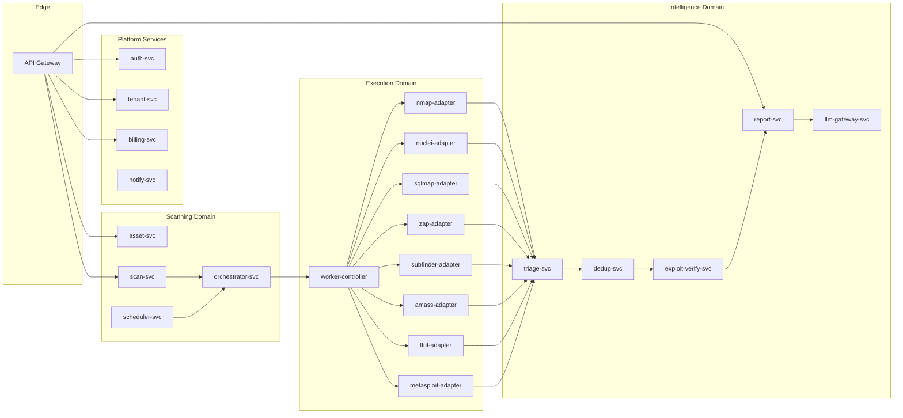

### Service Contracts

| Service | Protocol | Key Responsibility |
|---|---|---|
| `auth-svc` | gRPC | JWT issuance, RBAC, SAML/OIDC federation |
| `tenant-svc` | gRPC | Org provisioning, plan limits, isolation config |
| `billing-svc` | REST | Stripe integration, usage metering, invoices |
| `notify-svc` | Async (SNS) | Email, Slack, webhook delivery |
| `asset-svc` | REST/gRPC | Target CRUD, scope validation, asset tagging |
| `scan-svc` | REST/gRPC | Scan CRUD, config profiles, status tracking |
| `orchestrator-svc` | gRPC + SQS | DAG construction, phase sequencing, retry logic |
| `scheduler-svc` | Internal | Cron-based recurring scans, event triggers |
| `worker-controller` | gRPC | Pod lifecycle, resource allocation, health checks |
| `*-adapter` | Sidecar gRPC | Tool-specific CLI wrapper, output normalization |
| `triage-svc` | gRPC | AI-powered severity scoring, false-positive filtering |
| `dedup-svc` | gRPC | Cross-scan deduplication, vulnerability correlation |
| `exploit-verify-svc` | gRPC | Safe exploitation in sandbox, proof generation |
| `report-svc` | REST | PDF/HTML generation, compliance mapping |
| `llm-gateway-svc` | gRPC | LLM prompt orchestration, RAG over vuln knowledge |

---

## 3. Scan Orchestration Pipeline

Each scan executes as a **Directed Acyclic Graph (DAG)** of phases. The orchestrator constructs the DAG based on scan type and target.

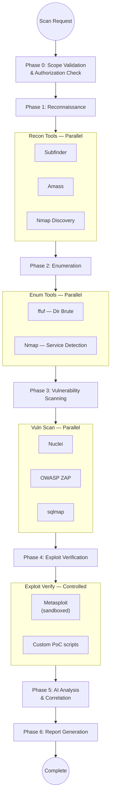

### Phase Details

| Phase | Parallelism | Timeout | Retry | Output |
|---|---|---|---|---|
| 0 — Scope Validation | 1 | 30s | 0 | scope.json |
| 1 — Reconnaissance | Up to 3 concurrent | 10min | 2 | hosts.json, subdomains.json |
| 2 — Enumeration | Up to 5 concurrent | 15min | 2 | services.json, directories.json |
| 3 — Vulnerability Scanning | Up to 8 concurrent | 30min | 1 | findings_raw.json |
| 4 — Exploit Verification | 1 (sequential, sandboxed) | 20min | 0 | exploits_verified.json |
| 5 — AI Analysis | 1 | 5min | 1 | findings_scored.json |
| 6 — Report Generation | 1 | 5min | 1 | report.pdf, report.html |

### Orchestrator State Machine

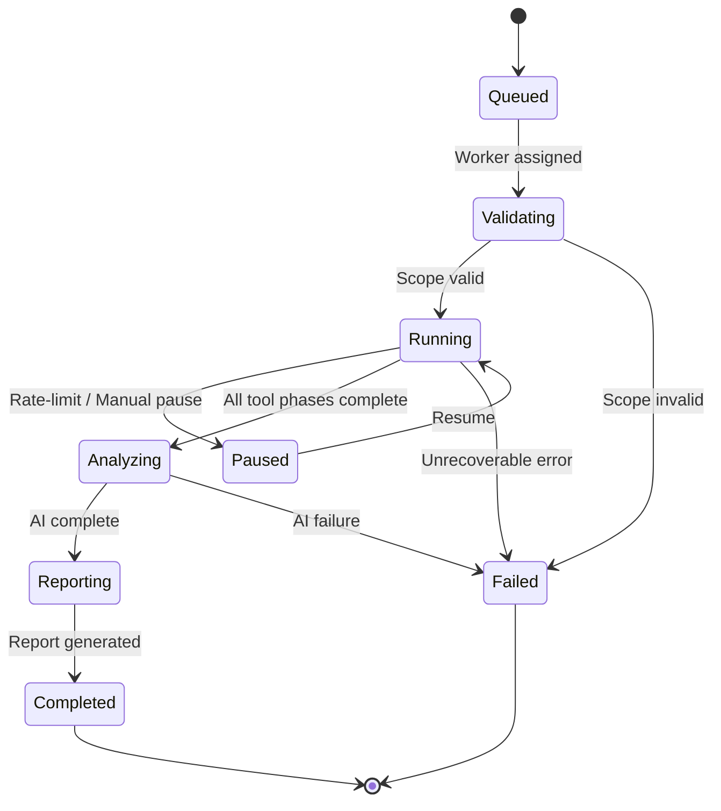

---

## 4. Worker Architecture

### Kubernetes Worker Cluster (EKS)

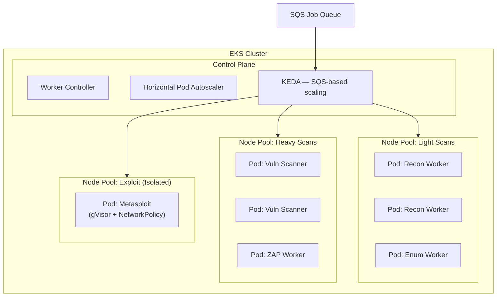

### Worker Pod Anatomy

Each worker pod runs a **sidecar architecture**:

```
┌─────────────────────────────────────────────────────┐
│  Worker Pod                                         │
│                                                     │
│  ┌──────────────┐  ┌──────────────┐  ┌───────────┐ │
│  │ Init:         │  │ Main:        │  │ Sidecar:  │ │
│  │ Config Loader │→ │ Tool Adapter │  │ Log Agent │ │
│  │ (pull scope,  │  │ (Nmap,Nuclei │  │ (Fluent   │ │
│  │  creds, TLS)  │  │  ZAP, etc.)  │  │  Bit)     │ │
│  └──────────────┘  └──────┬───────┘  └─────┬─────┘ │
│                           │                │        │
│                    ┌──────┴───────┐  ┌─────┴─────┐  │
│                    │ ephemeral    │  │ stdout →   │  │
│                    │ volume /work │  │ CloudWatch │  │
│                    └──────────────┘  └───────────┘  │
│                                                     │
│  Security: gVisor runtime · read-only rootfs        │
│            no-new-privileges · dropped capabilities │
│            network policy: egress only to target    │
└─────────────────────────────────────────────────────┘
```

### Capacity Planning (10,000 scans/day)

| Metric | Value |
|---|---|
| Avg scan duration | 15 min |
| Peak concurrent scans | ~420 (10k / 24h × 1hr overlap) |
| Max concurrent worker pods | 500 |
| Node pool: light (c6i.xlarge) | 20–40 nodes (auto-scaled) |
| Node pool: heavy (c6i.2xlarge) | 15–30 nodes (auto-scaled) |
| Node pool: exploit (m6i.xlarge, isolated) | 5–10 nodes |
| Queue backpressure threshold | 1,000 pending jobs |

### Scaling Strategy

- **KEDA** watches SQS queue depth → scales worker pods 0→N.
- **Cluster Autoscaler** adds EC2 nodes when pods are unschedulable.
- **Spot Instances** for light/enum pools (70% cost reduction).
- **On-Demand** for exploit pool (reliability required).
- **Pod Disruption Budgets** protect in-flight scans during node drain.

---

## 5. AI Analysis Pipeline

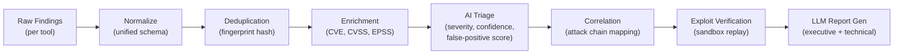

### AI Triage Engine

| Component | Technology | Purpose |
|---|---|---|
| Embedding model | Sentence-BERT / OpenAI embeddings | Vectorize findings for similarity search |
| Classification model | Fine-tuned transformer | Severity prediction, false-positive detection |
| RAG knowledge base | pgvector on RDS + S3 docs | Retrieval-augmented generation for context |
| LLM gateway | GPT-4o / Claude via `llm-gateway-svc` | Natural language report generation |
| Attack chain mapper | Custom graph algorithm | Link related findings into exploitation paths |

### AI Processing Flow

1. **Normalize** — Each tool adapter converts raw output into a unified `Finding` schema (CVE ID, affected host, evidence, severity hint).
2. **Deduplicate** — Compute a content-based fingerprint; merge duplicates across tools, keeping the richest evidence.
3. **Enrich** — Look up CVE details from NVD, attach CVSS v3.1 vectors, EPSS probability scores, and known-exploit databases (CISA KEV).
4. **AI Triage** — A fine-tuned classifier scores each finding on:
   - **Severity** (Critical / High / Medium / Low / Info)
   - **Confidence** (0–100%)
   - **False-positive probability** (0–100%)
5. **Correlation** — Build a directed graph of findings to identify multi-step attack chains (e.g., SSRF → internal service → RCE).
6. **Exploit Verification** — For Critical/High findings with confidence > 80%, replay a safe proof-of-concept exploit inside a sandboxed Metasploit container.
7. **LLM Report Generation** — RAG-augmented LLM produces:
   - **Executive summary** (non-technical, business-impact focused)
   - **Technical findings** (per-vulnerability detail with remediation)
   - **Compliance mapping** (OWASP Top 10, NIST, PCI-DSS)

---

## 6. Data Flow

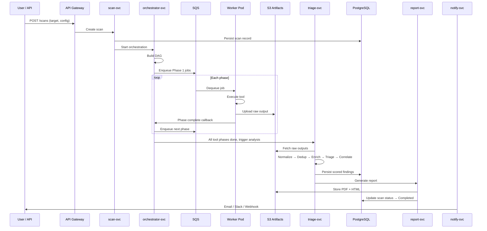

### Data at Rest

| Store | Data | Retention | Encryption |
|---|---|---|---|
| PostgreSQL (RDS) | Scans, findings, tenants, users | Indefinite | AES-256 (RDS encryption) |
| S3 | Raw tool output, reports, evidence | 90 days (configurable) | SSE-S3 / SSE-KMS |
| OpenSearch | Finding full-text, log aggregation | 30 days | Node-to-node TLS + at-rest |
| Redis | Session cache, rate-limit counters | Ephemeral | In-transit TLS |
| Vault | API keys, cloud creds, tool licenses | N/A | Seal/unseal with KMS |

---

## 7. Infrastructure Design (AWS)

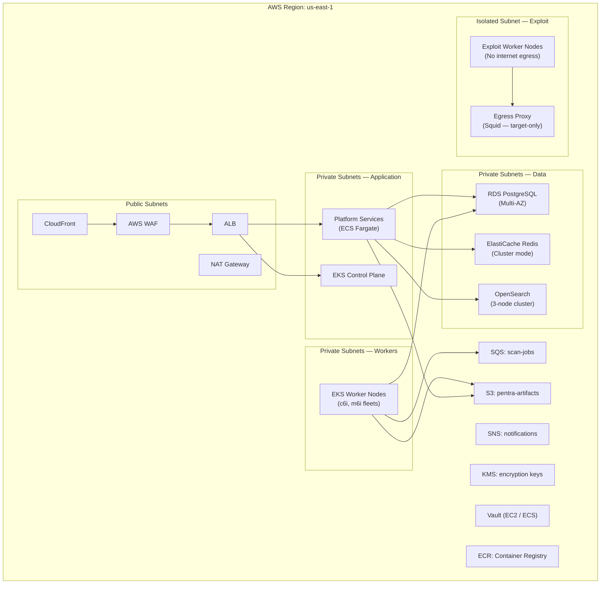

### AWS Services Map

| Service | AWS Resource | Config |
|---|---|---|
| Compute — Platform | ECS Fargate | 2–4 vCPU / 8 GB per service |
| Compute — Workers | EKS on EC2 | c6i.xlarge → c6i.4xlarge, Spot + OD |
| Database | RDS PostgreSQL 15 | db.r6g.2xlarge, Multi-AZ, read replicas |
| Cache | ElastiCache Redis 7 | cache.r6g.xlarge, cluster mode |
| Search | OpenSearch 2.x | r6g.xlarge.search, 3 data + 2 master |
| Queue | SQS (Standard) | High-throughput, DLQ configured |
| Object Storage | S3 | Lifecycle policies, Intelligent-Tiering |
| Secrets | Vault + KMS | Auto-unseal with KMS |
| CDN | CloudFront | Static SPA + API acceleration |
| DNS | Route 53 | Health-checked failover |
| Monitoring | CloudWatch + Prometheus + Grafana | Custom dashboards, alerting |
| CI/CD | CodePipeline + ArgoCD | GitOps for EKS deployments |

### Multi-AZ & DR

- All stateful services deployed **Multi-AZ**.
- RDS: automated backups (35-day retention), cross-region read replica for DR.
- S3: cross-region replication to `us-west-2`.
- EKS: node groups spread across 3 AZs.
- RPO: 1 hour | RTO: 4 hours.

---

## 8. Security Boundaries

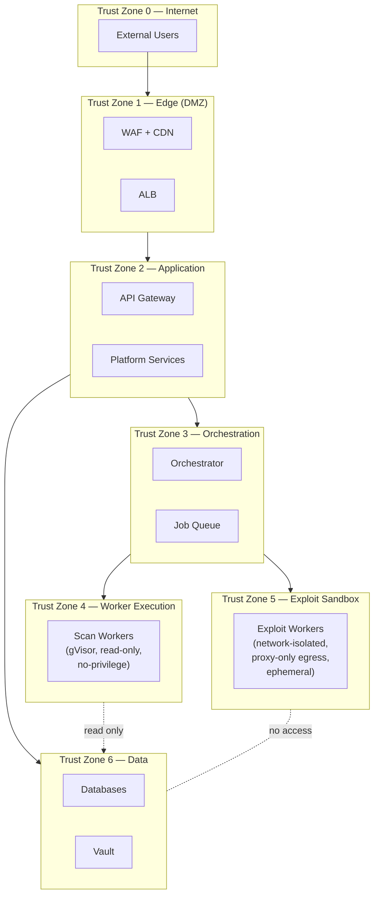

### Security Controls per Zone

| Zone | Controls |
|---|---|
| **Zone 0 → 1** | AWS WAF (OWASP rules, rate limiting, geo-blocking), CloudFront signed URLs |
| **Zone 1 → 2** | TLS 1.3 termination at ALB, mutual TLS for internal, JWT validation |
| **Zone 2 — App** | RBAC per tenant, request signing, input validation, CORS policies |
| **Zone 2 → 3** | Service mesh mTLS (Istio), service-to-service IAM roles |
| **Zone 3 → 4** | K8s NetworkPolicies (default-deny ingress), Pod Security Standards (restricted) |
| **Zone 4 — Workers** | gVisor runtime sandbox, read-only rootfs, dropped all capabilities, no-new-privileges, ephemeral volumes, resource quotas (CPU/memory/PID limits) |
| **Zone 5 — Exploit** | Isolated VPC subnet, Squid egress proxy (allow-listed targets only), no access to Zone 6, auto-destroy after use, time-boxed execution (max 5 min per exploit) |
| **Zone 6 — Data** | VPC endpoints (no internet), security groups (port-level ACLs), encryption at rest + in transit, Vault dynamic credentials (TTL: 1 hour) |

### Tenant Isolation Model

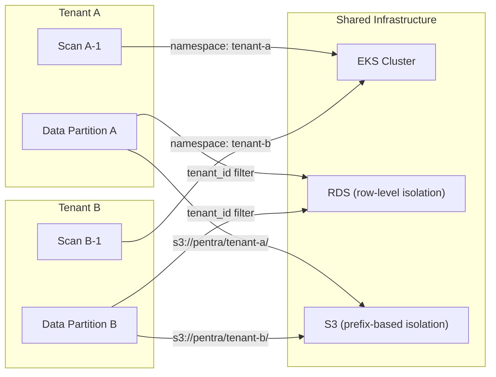

| Isolation Layer | Mechanism |
|---|---|
| **Compute** | K8s namespaces + resource quotas per tenant |
| **Network** | NetworkPolicies block cross-namespace traffic |
| **Database** | Row-level security (RLS) on `tenant_id` column |
| **Object Storage** | S3 prefix per tenant + IAM policy boundary |
| **Secrets** | Vault paths scoped per tenant (`secret/tenants/{id}/`) |
| **API** | JWT contains `tenant_id`; all queries filtered |

---

## 9. Distributed Scanning Architecture

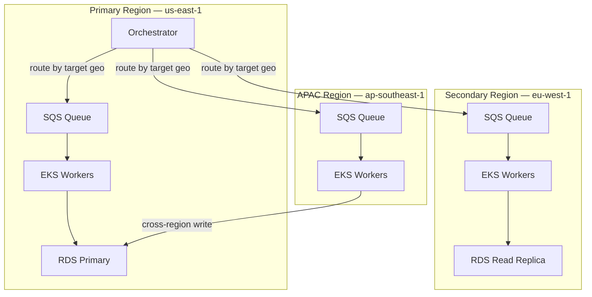

### Geo-Aware Routing

The orchestrator determines the optimal scan region based on:

1. **Target Location** — Resolve target IP/domain → geolocate → route to nearest region.
2. **Compliance** — Some tenants require scans originate from specific jurisdictions (EU, APAC).
3. **Load Balancing** — If primary region queue > threshold, overflow to secondary.
4. **Latency** — Network scans (Nmap) benefit from geographic proximity.

### Distributed Scan Aggregation

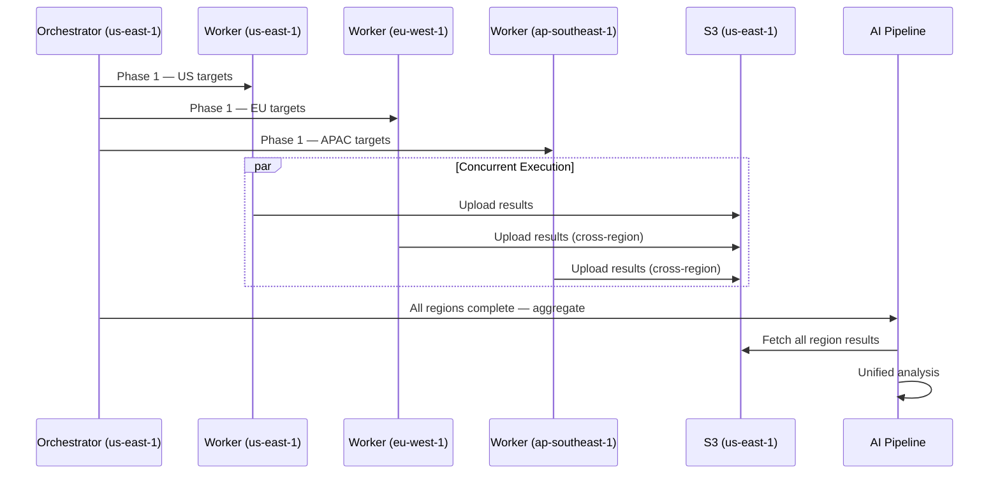

### Rate Limiting & Stealth

| Control | Purpose | Implementation |
|---|---|---|
| **Requests/sec throttle** | Avoid IDS/WAF triggers on target | Configurable per scan profile (1–100 rps) |
| **IP rotation** | Distribute requests across source IPs | Elastic IP pool + NAT gateway rotation |
| **User-Agent rotation** | Evade simple signature blocks | Randomized UA per request |
| **Jitter** | Prevent detection of automated patterns | Random delay ±20% between requests |
| **Scan windows** | Avoid business-hour disruption | Tenant-configurable scheduling |

---

## Appendix: Technology Stack Summary

| Layer | Technologies |
|---|---|
| **Frontend** | React, TypeScript, Vite, TanStack Query |
| **API Gateway** | Kong / AWS API Gateway |
| **Platform Services** | Go (high-throughput), Python (AI/ML) |
| **Message Queue** | Amazon SQS, SNS |
| **Container Runtime** | EKS, gVisor, containerd |
| **Orchestration** | Custom DAG engine (Go) |
| **AI/ML** | Python, PyTorch, LangChain, pgvector |
| **LLM** | GPT-4o / Claude (via gateway) |
| **Database** | PostgreSQL 15 (RDS), Redis 7 |
| **Search** | OpenSearch 2.x |
| **Secrets** | HashiCorp Vault, AWS KMS |
| **Observability** | Prometheus, Grafana, OpenTelemetry, CloudWatch |
| **CI/CD** | GitHub Actions, ArgoCD, Terraform |
| **Security Tools** | Nmap, Nuclei, sqlmap, ZAP, Subfinder, Amass, ffuf, Metasploit |


## MOD-01.5 — Architecture Stress Test

# Pentra — Architecture Validation Report

> Deep analysis of the v1 architecture across 9 risk dimensions, with redesigned components where weaknesses were found.

---

## Validation Summary

| Risk Dimension | Verdict | Weaknesses Found | Severity |
|---|---|---|---|
| Scalability | ⚠️ Conditional Pass | 3 | High |
| Bottleneck Analysis | ❌ Fail | 4 | Critical |
| Scan Orchestration Failures | ⚠️ Conditional Pass | 2 | High |
| AI Pipeline Overload | ❌ Fail | 3 | Critical |
| Worker Scheduling | ⚠️ Conditional Pass | 2 | Medium |
| Multi-Tenant Isolation | ❌ Fail | 3 | Critical |
| AWS Cost Efficiency | ⚠️ Conditional Pass | 3 | High |
| Scan Execution Security | ⚠️ Conditional Pass | 2 | High |
| Exploit Containment | ❌ Fail | 1 | Critical |
| **Total** | | **23 weaknesses** | |

---

## 1. Scalability Risks

### 10,000 Scans/Day Stress Test

The v1 capacity model assumed a **uniform distribution** — scans spread evenly over 24 hours. This is unrealistic.

```
V1 Assumption:  10,000 / 24h = 417 scans/hr (steady state)
Reality:        Business-hour peak = 70% of scans in 10 hours
                → 7,000 / 10h = 700 scans/hr peak
                → 1.5x burst = 1,050 scans/hr spike
```

| Metric | V1 Estimate | Corrected (Peak) | Gap |
|---|---|---|---|
| Concurrent scans | ~420 | ~700 sustained, ~1,050 burst | **+67% to +150%** |
| Avg scan phases | 6 | 6 | — |
| Jobs per scan | ~12 (avg tools) | ~12 | — |
| Peak jobs/hr | ~5,000 | **~12,600** | +152% |
| Peak jobs/min | ~83 | **~210** | +152% |

> [!CAUTION]
> **W-1: The v1 capacity model underestimates peak concurrency by 67–150%.** The worker pool (500 max pods) and SQS throughput are undersized for real-world burst patterns.

> [!WARNING]
> **W-2: Single orchestrator-svc is a horizontal scaling blind spot.** The v1 design shows one `orchestrator-svc` managing all DAGs. At 700+ concurrent scans, each tracking 6+ phases with callbacks, a single instance will exhaust memory and connection pools.

> [!WARNING]
> **W-3: RDS PostgreSQL write contention.** 10K scans/day × ~50 finding writes per scan = **500,000 inserts/day**. During peak, this is ~35K writes/hr on a single-writer Multi-AZ RDS. Combined with scan status updates (state machine transitions), this saturates a `db.r6g.2xlarge`.

### ✅ Redesign: Scalability Fixes

**Fix W-1 — Revised capacity model:**

| Metric | Redesigned Value |
|---|---|
| Max concurrent worker pods | **800** (up from 500) |
| Node pool: light | 30–60 nodes |
| Node pool: heavy | 25–50 nodes |
| Node pool: exploit | 8–15 nodes |
| SQS → FIFO with high-throughput mode | 3,000 msg/sec/queue (partitioned by tenant tier) |
| Queue backpressure threshold | 2,500 pending jobs |

**Fix W-2 — Orchestrator sharding:**

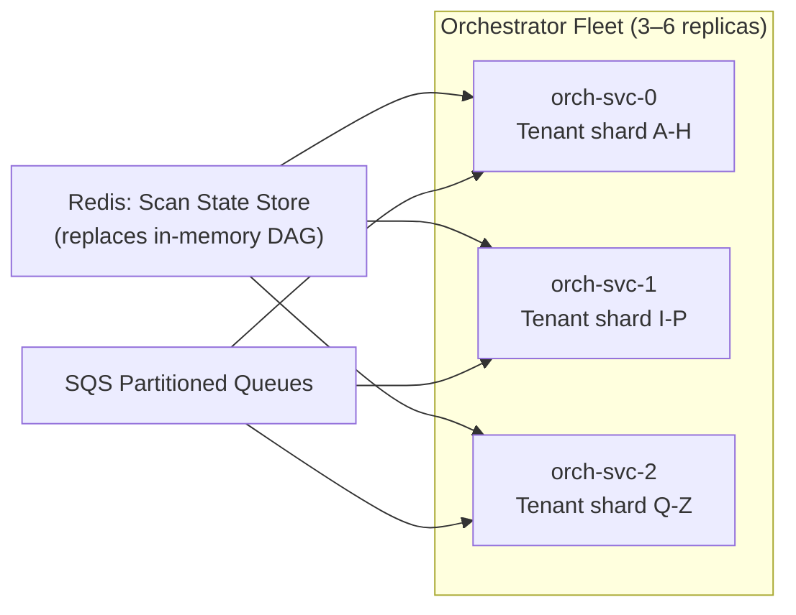

- Orchestrator becomes **stateless** — DAG state externalized to Redis.
- Sharded by **tenant-id hash** to distribute load evenly.
- Any replica can recover a scan if another fails (Redis has the state).

**Fix W-3 — Database write optimization:**

- Findings written to a **write-ahead buffer (SQS → batch insert Lambda)** instead of direct RDS writes.
- Scan status transitions written to **Redis first**, periodically flushed to RDS (eventual consistency acceptable for status).
- Add **RDS Proxy** to pool connections (prevent connection exhaustion).
- Upgrade to `db.r6g.4xlarge` or introduce **Aurora PostgreSQL** with write-forwarding.

---

## 2. Bottleneck Analysis

> [!CAUTION]
> **W-4: S3 as sole inter-phase data channel is a latency bottleneck.** Every tool output → S3 upload → next phase S3 download creates a minimum 200–500ms latency per phase transition. Over 6 phases: **1.2–3 seconds of pure I/O overhead per scan**, and at 700 concurrent scans, S3 PUT/GET rates reach 8,400 ops/min.

> [!CAUTION]
> **W-5: AI pipeline is synchronous and single-threaded per scan.** The v1 design shows a linear pipeline: Normalize → Dedup → Enrich → Triage → Correlate → Verify → Report. At 700 concurrent scans completing within a burst window, the AI pipeline faces a **thundering herd** — hundreds of scans hitting triage-svc simultaneously after their tool phases complete.

> [!WARNING]
> **W-6: LLM gateway is a throughput ceiling.** GPT-4o / Claude API rate limits are typically 500–3,000 RPM. At 10K scans/day with 2–3 LLM calls per report (executive summary + technical + compliance), that's **20–30K LLM calls/day**. During peak: **2,100 calls/hr = 35 calls/min** — manageable individually, but combined with retry/timeout overhead and token limits (50K+ tokens per report), queue depth explodes.

> [!WARNING]
> **W-7: Callback-based phase coordination is fragile.** Workers send "phase complete" callbacks to orchestrator via gRPC. If orchestrator is restarting, callbacks are lost. No durable callback mechanism exists.

### ✅ Redesign: Bottleneck Elimination

**Fix W-4 — Hybrid data channel:**

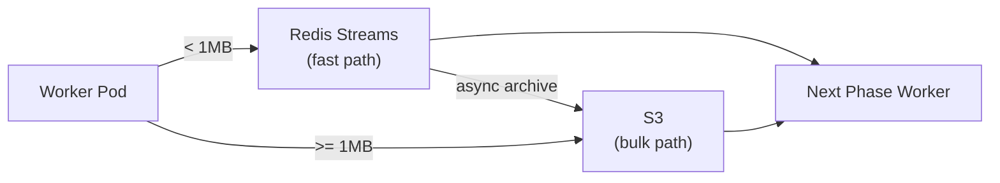

- Small outputs (host lists, service discovery) go through **Redis Streams** (sub-1ms latency).
- Large outputs (full ZAP reports, Nmap XML) go to S3.
- Redis Streams data is **asynchronously archived** to S3 for durability.

**Fix W-5 — Async AI pipeline with buffered ingestion:**

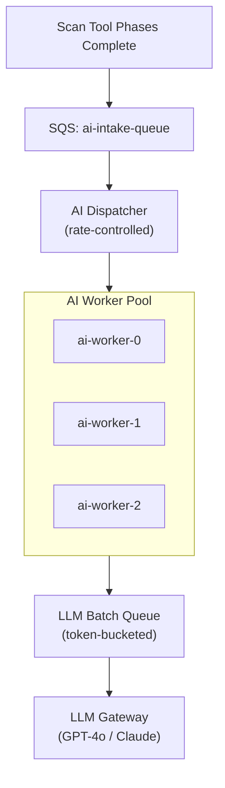

- AI intake is **queue-buffered** — scans don't directly call triage-svc.
- AI Dispatcher enforces a **concurrency semaphore** (max 50 concurrent AI analyses).
- LLM calls use a **token-bucket rate limiter** (respects provider RPM limits).
- AI workers are **horizontally scaled** via KEDA (SQS queue depth trigger).

**Fix W-6 — LLM optimization:**

| Strategy | Impact |
|---|---|
| Pre-built report templates | Reduce LLM token usage by 60% |
| Tiered LLM routing: GPT-4o-mini for Low/Medium findings, GPT-4o for Critical/High | Reduce cost by 40%, increase throughput by 3x |
| Report caching: hash-based dedup for identical finding patterns | Avoid redundant LLM calls |
| Batch API: submit reports in batches of 10 | 50% latency reduction on OpenAI batch endpoint |

**Fix W-7 — Event-driven phase coordination (replaces callbacks):**

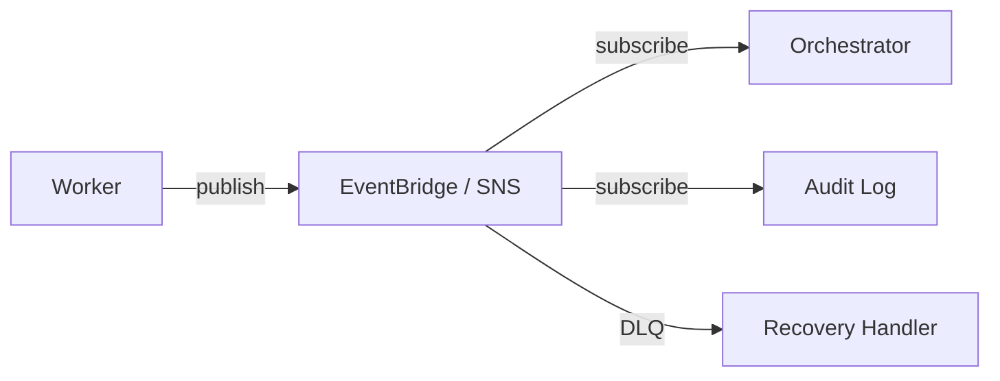

- Workers **publish** completion events to EventBridge (durable, at-least-once).
- Orchestrator **subscribes** — no direct callback dependency.
- Failed events land in a **DLQ** with a recovery handler.

---

## 3. Scan Orchestration Failures

> [!WARNING]
> **W-8: No partial-failure handling in DAG phases.** If 2 of 3 recon tools succeed but Amass times out, the v1 design retries the entire phase or fails. There's no mechanism to proceed with partial results.

> [!WARNING]
> **W-9: No scan priority system.** All 10K scans compete equally for workers. A critical on-demand scan must wait behind 500 queued scheduled scans.

### ✅ Redesign: Resilient Orchestration

**Fix W-8 — Partial-success phase completion:**

```
Phase completion rule:
  if (succeeded_tools / total_tools) >= phase.min_success_ratio:
      mark phase = PARTIAL_SUCCESS
      proceed to next phase with available data
      log degradation warning
  else:
      mark phase = FAILED
      apply retry policy
```

| Phase | Min Success Ratio | Rationale |
|---|---|---|
| Recon | 1/3 (33%) | Any single tool provides enough seed data |
| Enum | 1/2 (50%) | Either directory or service enum is useful |
| Vuln Scan | 2/3 (66%) | Need majority coverage for credibility |
| Exploit | 1/1 (100%) | Must succeed or skip entirely |

**Fix W-9 — Priority queue architecture:**

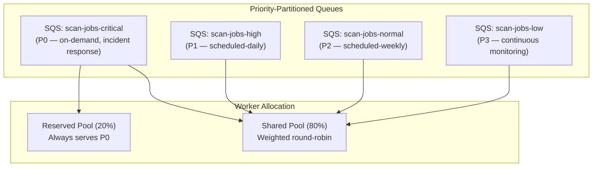

- 20% of worker capacity is **reserved** for P0 (on-demand / incident response).
- Shared pool uses **weighted fair queuing**: P0=8, P1=4, P2=2, P3=1.

---

## 4. AI Pipeline Overload

> [!CAUTION]
> **W-10: No backpressure from AI to orchestrator.** If the AI pipeline is overloaded, completed scans pile up with no feedback to slow down new scan submissions.

> [!WARNING]
> **W-11: CVE enrichment is an external API dependency.** NVD API rate limit is 5 req/sec (with API key). At 10K scans × 50 findings × enrichment lookup = **500K NVD lookups/day**. Even cached, cold-start days will overwhelm the API.

> [!WARNING]
> **W-12: No AI model failover.** If GPT-4o is down, the entire report generation pipeline halts.

### ✅ Redesign: Hardened AI Pipeline

**Fix W-10 — Backpressure signaling:**

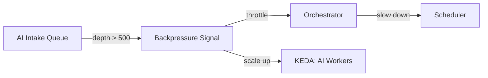

- AI intake queue depth is monitored by a **CloudWatch alarm**.
- At depth > 500: **scale up** AI workers (KEDA).
- At depth > 2,000: **throttle** orchestrator (reduce new scan starts by 50%).
- At depth > 5,000: **pause** scheduler (stop new scheduled scans).

**Fix W-11 — Local CVE mirror:**

| Component | Design |
|---|---|
| NVD Mirror | Nightly sync of full NVD JSON feed → PostgreSQL table |
| EPSS Mirror | Daily CSV download → PostgreSQL |
| CISA KEV | Daily JSON sync → PostgreSQL |
| Lookup | Local DB query (sub-1ms) instead of API call |
| Freshness SLA | Max 24h stale (acceptable for CVE data) |

**Fix W-12 — Multi-provider LLM failover:**

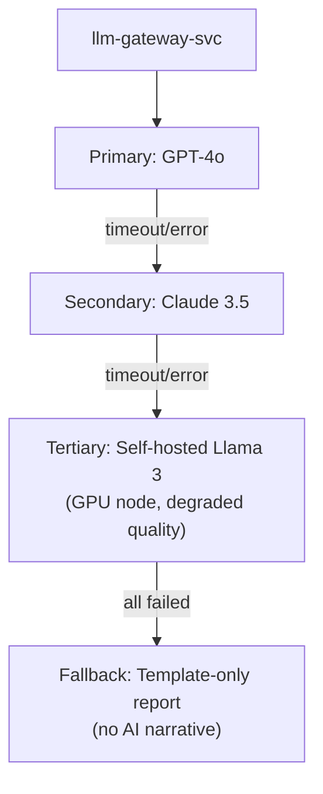

- Circuit breaker pattern: 5 consecutive failures → switch to next provider.
- Self-hosted Llama 3 on a **g5.2xlarge** instance as disaster backup.
- Template-only fallback ensures reports are **always generated** even if all LLMs are down.

---

## 5. Worker Scheduling Problems

> [!WARNING]
> **W-13: Spot Instance interruption during active scans.** V1 uses Spot for light/enum pools but has no scan migration strategy. A 2-minute Spot interruption warning is insufficient to complete a 15-min ffuf brute-force.

> [!WARNING]
> **W-14: No worker affinity for multi-phase scans.** A scan's recon phase runs on Node A, but its enum phase may schedule on Node B in a different AZ, adding cross-AZ data transfer latency and cost.

### ✅ Redesign: Resilient Scheduling

**Fix W-13 — Spot-aware scan checkpointing:**

```
┌──────────────────────────────────────────────────────────┐
│  Spot Interruption Handler                               │
│                                                          │
│  1. EC2 metadata poll (2-sec interval)                   │
│  2. On interruption notice:                              │
│     a. Signal running tool → graceful stop               │
│     b. Checkpoint partial results to S3                  │
│        (nmap: --resume support)                          │
│        (ffuf: -sf save state)                            │
│        (nuclei: -resume flag)                            │
│     c. Re-enqueue job with checkpoint_id                 │
│     d. New worker resumes from checkpoint                │
│  3. Max 2 checkpoint-resumes per job (then use On-Demand)│
│                                                          │
│  Supported tools:                                        │
│    ✅ Nmap (--resume)                                    │
│    ✅ ffuf (-sf state file)                              │
│    ✅ Nuclei (-resume)                                   │
│    ⚠️ ZAP (session save — partial)                      │
│    ❌ sqlmap (no native resume — restart from scratch)   │
│    ❌ Metasploit (never on Spot)                         │
└──────────────────────────────────────────────────────────┘
```

**Fix W-14 — AZ-affinity scheduling:**

- Add a **pod topology spread constraint**: prefer same AZ for all phases of a scan.
- Store `preferred_az` in the scan's Redis state; worker-controller uses it as a scheduling hint.
- If preferred AZ is capacity-constrained, fall back to any AZ (availability > affinity).

---

## 6. Multi-Tenant Isolation Issues

> [!CAUTION]
> **W-15: RLS bypassed via bulk operations.** Row-Level Security on `tenant_id` works for ORM queries, but raw SQL in `report-svc` or `orchestrator-svc` (batch operations, analytics aggregation) can bypass RLS if the session `tenant_id` is not set. A single bug = cross-tenant data leak.

> [!CAUTION]
> **W-16: K8s namespace-per-tenant doesn't scale.** At 1,000 tenants, K8s has 1,000 namespaces. The API server degrades, RBAC policies explode in size, and NetworkPolicy evaluation becomes O(n²).

> [!WARNING]
> **W-17: No noisy-neighbor protection at the scan level.** A tenant with an Enterprise plan running 500 concurrent scans can starve other tenants' workers. Resource quotas per namespace help, but if 100 tenants share 5 "tier-2" namespaces, one tenant can still dominate.

### ✅ Redesign: Hardened Tenant Isolation

**Fix W-15 — Defense-in-depth for data isolation:**

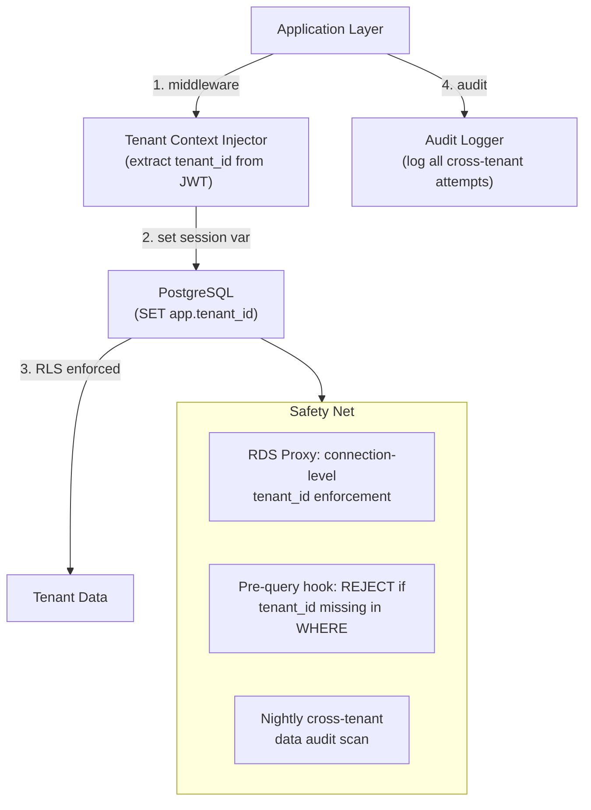

| Layer | Control |
|---|---|
| **L1 — Middleware** | Extract `tenant_id` from JWT, inject into all downstream calls |
| **L2 — DB Session** | `SET app.tenant_id = ?` before every transaction |
| **L3 — RLS** | PostgreSQL RLS policy on every tenant-scoped table |
| **L4 — Query Hook** | ORM-level hook rejects any query without `tenant_id` in predicate |
| **L5 — Audit** | Nightly job compares row counts per tenant vs access logs; flag anomalies |

**Fix W-16 — Tier-based namespace model (replaces per-tenant namespace):**

```mermaid
graph LR
    subgraph NS_MODEL["Revised Namespace Model"]
        NS_FREE["ns: tier-free<br/>(shared, best-effort)"]
        NS_PRO["ns: tier-pro<br/>(shared, guaranteed resources)"]
        NS_ENT_1["ns: tier-ent-tenant-A<br/>(dedicated per enterprise tenant)"]
        NS_ENT_2["ns: tier-ent-tenant-B<br/>(dedicated per enterprise tenant)"]
        NS_EXPLOIT["ns: exploit-sandbox<br/>(all tenants, ephemeral pods)"]
    end
```

| Tenant Tier | Namespace Strategy | Isolation |
|---|---|---|
| Free | Shared `tier-free` namespace | Pod labels + ResourceQuota per tenant |
| Pro | Shared `tier-pro` namespace (5–10 tenants per NS) | LimitRange + PriorityClass |
| Enterprise | **Dedicated namespace** per tenant | Full namespace isolation |

- Reduces total namespaces from ~1,000 to **~50–100**.
- Enterprise tenants still get full isolation.

**Fix W-17 — Per-tenant rate limiting:**

```
Tenant scan concurrency limits:
  Free:       2 concurrent scans,   100/day quota
  Pro:        20 concurrent scans,  1,000/day quota
  Enterprise: 200 concurrent scans, unlimited/day

Enforcement:
  - scan-svc checks Redis counter before accepting scan
  - orchestrator-svc enforces per-tenant semaphore on worker allocation
  - Billing alerts at 80% quota usage
```

---

## 7. AWS Cost Inefficiencies

> [!WARNING]
> **W-18: Idle worker nodes during off-peak.** V1 uses Cluster Autoscaler, but minimum node count is high (20 light + 15 heavy = 35 always-on). At $0.17/hr for c6i.xlarge, 35 idle nodes = **$4,400/month wasted during off-peak hours** (14h/day × 30 days).

> [!WARNING]
> **W-19: NAT Gateway data transfer costs.** Workers download tool databases (Nuclei templates, Nmap scripts) and upload results through NAT Gateway. At $0.045/GB, 10K scans × ~50MB avg output = **500GB/day = $675/month** in NAT charges alone.

> [!WARNING]
> **W-20: OpenSearch over-provisioned.** 3 data nodes + 2 master nodes for a 30-day retention finding search index is expensive (~$1,200/month). Most queries are by `scan_id` or `tenant_id` — PostgreSQL with GIN indexes handles this without a separate cluster.

### ✅ Redesign: Cost Optimization

**Fix W-18 — Aggressive scale-to-near-zero:**

| Strategy | Savings |
|---|---|
| Karpenter (replaces Cluster Autoscaler) | Faster scaling (30s vs 3–5min), better bin-packing |
| Minimum nodes: light=2, heavy=2, exploit=0 | Reduce idle cost by 80% |
| Warm pool: 5 pre-initialized EC2 in Spot fleet | Fast burst without keeping nodes running |
| Graviton (c7g) instances for light workloads | 20% price reduction vs c6i |

**Fix W-19 — NAT Gateway cost elimination:**

| Strategy | Savings |
|---|---|
| VPC endpoints for S3 | Eliminate S3 NAT charges (~$300/mo) |
| VPC endpoints for SQS, ECR | Eliminate queue/registry NAT charges |
| Pre-bake tool databases into container images (ECR) | Eliminate runtime downloads |
| Gateway endpoint for S3 (free), Interface endpoints for SQS ($0.01/hr) | Net saving: ~$500/mo |

**Fix W-20 — Replace OpenSearch with PostgreSQL full-text search:**

| Before | After |
|---|---|
| OpenSearch 3-node cluster (~$1,200/mo) | PostgreSQL GIN index + `tsvector` ($0 incremental) |
| Separate search infrastructure | Unified data layer |

- Keep OpenSearch **only** for log aggregation (use CloudWatch Logs Insights instead for further savings).
- Finding search uses PostgreSQL `tsvector` with GIN indexing — handles 10K QPS at this data volume.

### Revised Monthly Cost Estimate

| Component | V1 Cost | V2 Cost | Savings |
|---|---|---|---|
| EKS worker nodes | $18,000 | $9,500 | 47% |
| RDS | $3,200 | $3,800 (Aurora) | -19% (justified by perf) |
| NAT Gateway | $1,200 | $200 | 83% |
| OpenSearch | $1,200 | $0 | 100% |
| S3 | $500 | $400 | 20% |
| LLM API | $3,000 | $1,800 | 40% |
| Other (ElastiCache, Vault, etc.) | $2,000 | $1,800 | 10% |
| **Total** | **~$29,100** | **~$17,500** | **40%** |

---

## 8. Scan Execution Security Weaknesses

> [!WARNING]
> **W-21: gVisor performance overhead on Nmap.** gVisor intercepts syscalls in userspace. Nmap's raw socket operations (SYN scans) require kernel-level packet crafting. gVisor either blocks these or adds 2–5x latency, breaking Nmap's timing-based OS detection.

> [!WARNING]
> **W-22: Tool adapter images contain exploit databases.** Nuclei and Metasploit container images ship with full vulnerability/exploit databases. If an attacker escapes the container, they gain access to a comprehensive exploit toolkit.

### ✅ Redesign: Security Hardening

**Fix W-21 — Tiered runtime isolation:**

| Tool | Runtime | Rationale |
|---|---|---|
| Subfinder, Amass | gVisor | Pure HTTP/DNS — no raw sockets |
| ffuf | gVisor | HTTP-only |
| Nuclei | gVisor | HTTP-only templates (majority) |
| Nmap | **runc + seccomp profile** | Requires raw sockets; custom seccomp allows only `CAP_NET_RAW` |
| OWASP ZAP | **runc + seccomp profile** | JVM + proxy needs full syscall set |
| sqlmap | gVisor | HTTP-only |
| Metasploit | **Firecracker microVM** | Maximum isolation (see W-23 fix) |

**Fix W-22 — Ephemeral tool injection:**

```
┌─────────────────────────────────────────────────┐
│  Revised Worker Pod                             │
│                                                 │
│  Base image: minimal Alpine + adapter binary    │
│  Tool binary: mounted read-only from S3/EFS     │
│  Templates/DB: pulled at runtime, wiped on exit │
│                                                 │
│  → Container image contains NO exploit data     │
│  → Exploit DBs are never on persistent storage  │
└─────────────────────────────────────────────────┘
```

---

## 9. Exploit Containment Risks

> [!CAUTION]
> **W-23: gVisor + NetworkPolicy is insufficient for Metasploit containment.** Metasploit generates real exploit payloads. gVisor has known bypass CVEs (e.g., CVE-2023-33551). A compromised Metasploit container in a shared EKS cluster is **one kernel exploit away from accessing the underlying node**, which may host other tenants' worker pods.

### ✅ Redesign: Firecracker-Based Exploit Isolation

```mermaid
graph TB
    subgraph EXPLOIT_ARCH["Revised Exploit Architecture"]
        ORCH["Orchestrator"] -->|trigger| LAUNCHER["Exploit Launcher<br/>(dedicated EC2 fleet)"]

        subgraph BARE_METAL["Dedicated Exploit Host (metal instance)"]
            FC1["Firecracker microVM 1<br/>(Metasploit)"]
            FC2["Firecracker microVM 2<br/>(Custom PoC)"]
        end

        LAUNCHER --> FC1
        LAUNCHER --> FC2

        FC1 -->|"egress: target-only<br/>(iptables on host)"| TARGET["Target"]
        FC1 -->|results via| RESULT_Q["SQS: exploit-results"]
        FC1 -.->|NO access| EKS["EKS Cluster"]
        FC1 -.->|NO access| RDS["RDS"]
    end
```

| Control | V1 (gVisor + K8s) | V2 (Firecracker) |
|---|---|---|
| Isolation level | Container (shared kernel) | **microVM (dedicated kernel)** |
| Kernel exploit blast radius | Entire node (multi-tenant) | **Single microVM only** |
| Network isolation | K8s NetworkPolicy (bypassable) | **Host-level iptables** (hardware enforced) |
| Lifecycle | Pod (may persist) | **Destroyed after each exploit** |
| Infrastructure | Shared EKS nodes | **Dedicated bare-metal fleet** |
| Startup time | ~2s | ~125ms (Firecracker) |
| Cost | Shared | +$800/mo (3× i3.metal instances) |

**Exploit execution flow (revised):**

1. Orchestrator sends exploit job to `SQS: exploit-jobs`.
2. Exploit Launcher (runs on dedicated EC2 fleet, NOT in EKS) provisions a Firecracker microVM.
3. MicroVM boots in ~125ms with: Metasploit, target scope, time limit (5 min).
4. Host-level iptables allow egress **only** to the authorized target IP.
5. MicroVM writes results to an ephemeral volume → pushed to SQS.
6. MicroVM is **destroyed**. The host's [/dev/kvm](file:///dev/kvm) is the only shared resource.
7. Dedicated hosts rotate weekly (AMI rebuild) to prevent persistence.

---

## Revised System Components Diagram

```mermaid
graph TB
    subgraph CLIENT["Client Layer"]
        WEB["Web Dashboard"]
        CLI["CLI / SDK"]
        API_EXT["Public API"]
    end

    subgraph GATEWAY["Edge Layer"]
        CDN["CloudFront"]
        WAF["AWS WAF"]
        ALB["ALB"]
        APIGW["API Gateway"]
    end

    subgraph CORE["Core Platform (ECS Fargate)"]
        AUTH["auth-svc"]
        TENANT["tenant-svc"]
        SCAN["scan-svc"]
        ASSET["asset-svc"]
        BILLING["billing-svc"]
        NOTIFY["notify-svc"]
    end

    subgraph ORCHESTRATION["Orchestration Layer"]
        ORCH["orchestrator-svc<br/>(stateless, 3–6 replicas,<br/>tenant-sharded)"]
        SCHED["scheduler-svc"]
        EBUS["EventBridge<br/>(phase events)"]
        PQUEUES["Priority SQS Queues<br/>(P0–P3)"]
    end

    subgraph WORKER["Worker Layer (EKS + Karpenter)"]
        CTRL["worker-controller"]
        LIGHT["Light Pool<br/>(gVisor, Spot, Graviton)"]
        HEAVY["Heavy Pool<br/>(runc+seccomp, Spot/OD)"]
    end

    subgraph EXPLOIT_LAYER["Exploit Layer (Dedicated EC2)"]
        LAUNCHER["Exploit Launcher"]
        FIRECRACKER["Firecracker microVMs"]
    end

    subgraph AI_LAYER["AI Layer"]
        INTAKE["AI Intake Queue"]
        DISPATCHER["AI Dispatcher<br/>(rate-controlled)"]
        AI_POOL["AI Worker Pool<br/>(3–8 replicas)"]
        LLM_GW["LLM Gateway<br/>(multi-provider failover)"]
        CVE_MIRROR["Local CVE/EPSS Mirror"]
    end

    subgraph DATA["Data Layer"]
        AURORA["Aurora PostgreSQL<br/>(+ pgvector, tsvector)"]
        REDIS["Redis<br/>(state, cache, streams)"]
        S3["S3 Artifacts"]
        VAULT["Vault"]
    end

    CLIENT --> GATEWAY
    GATEWAY --> CORE
    CORE --> ORCHESTRATION
    ORCHESTRATION --> WORKER
    ORCHESTRATION --> EXPLOIT_LAYER
    WORKER -->|results via Redis Streams + S3| AI_LAYER
    EXPLOIT_LAYER -->|results via SQS| AI_LAYER
    AI_LAYER --> DATA
    CORE --> DATA
    ORCHESTRATION -->|state| REDIS
```

---

## Revised Orchestrator State Machine

```mermaid
stateDiagram-v2
    [*] --> Queued
    Queued --> PriorityQueued: Assign priority (P0–P3)
    PriorityQueued --> Validating: Worker assigned
    Validating --> Running: Scope valid
    Validating --> Rejected: Scope invalid / quota exceeded
    Running --> PartialSuccess: Phase partial (min_ratio met)
    PartialSuccess --> Running: Next phase
    Running --> Paused: Rate-limit / Manual / Backpressure
    Paused --> Running: Resume
    Running --> Analyzing: All tool phases complete
    PartialSuccess --> Analyzing: All phases attempted
    Analyzing --> AIQueued: Backpressure — queued for AI
    AIQueued --> Analyzing: AI capacity available
    Analyzing --> Reporting: AI complete
    Reporting --> Completed: Report generated
    Running --> Failed: Unrecoverable error
    Running --> Checkpointed: Spot interruption
    Checkpointed --> Queued: Re-enqueue with checkpoint
    Analyzing --> Reporting: AI failover to template
    Completed --> [*]
    Failed --> [*]
    Rejected --> [*]
```

---

## Summary of All Changes

| # | Weakness | Fix | Impact |
|---|---|---|---|
| W-1 | Capacity underestimated | Peak-adjusted capacity model | ↑ Reliability |
| W-2 | Single orchestrator | Stateless sharded fleet + Redis state | ↑ Scalability |
| W-3 | RDS write contention | Write buffer + Aurora + RDS Proxy | ↑ Throughput |
| W-4 | S3 latency bottleneck | Redis Streams hybrid data channel | ↓ Latency |
| W-5 | Synchronous AI pipeline | Async queue-buffered AI workers | ↑ Throughput |
| W-6 | LLM throughput ceiling | Tiered routing + batch API + caching | ↓ Cost, ↑ Speed |
| W-7 | Fragile callbacks | EventBridge event-driven coordination | ↑ Reliability |
| W-8 | No partial-failure handling | Min-success-ratio per phase | ↑ Resilience |
| W-9 | No scan priority | Priority queues + reserved pools | ↑ SLA adherence |
| W-10 | No AI backpressure | Queue-depth alerting + throttle cascade | ↑ Stability |
| W-11 | NVD API dependency | Local CVE/EPSS mirror | ↑ Reliability |
| W-12 | No LLM failover | Multi-provider chain + template fallback | ↑ Availability |
| W-13 | Spot interruption data loss | Tool-native checkpointing | ↑ Reliability |
| W-14 | Cross-AZ scheduling overhead | AZ-affinity pod constraints | ↓ Latency, ↓ Cost |
| W-15 | RLS bypass risk | 5-layer defense-in-depth | ↑ Security |
| W-16 | Namespace explosion | Tier-based namespace model | ↑ Scalability |
| W-17 | Noisy neighbor | Per-tenant concurrency limits | ↑ Fairness |
| W-18 | Idle node waste | Karpenter + Graviton + near-zero scaling | ↓ Cost (47%) |
| W-19 | NAT Gateway costs | VPC endpoints + pre-baked images | ↓ Cost (83%) |
| W-20 | OpenSearch over-provisioned | PostgreSQL tsvector replacement | ↓ Cost (100%) |
| W-21 | gVisor breaks Nmap | Tiered runtime (gVisor / runc+seccomp) | ↑ Compatibility |
| W-22 | Exploit data in images | Ephemeral tool injection | ↑ Security |
| W-23 | Container-level exploit isolation | Firecracker microVMs on dedicated hosts | ↑↑ Security |

---
---

## MOD-02 — Monorepo & Base Infrastructure

# Pentra — Repository Architecture & Base Infrastructure

> Monorepo design for a distributed offensive-security SaaS platform
> Python/FastAPI · Next.js · Celery · EKS · Terraform · 10,000 scans/day

---

## 1. Monorepo Directory Tree

```
pentra/
├── README.md
├── LICENSE
├── Makefile                          # Top-level build/dev commands
├── .env.example                     # Template for local env vars
├── .gitignore
├── .pre-commit-config.yaml          # Linting, formatting, secrets scanning
│
├── MASTER_INDEX.md                   # Module roadmap (SSoT)
├── SESSION_CONTEXT.md                # Current development state
├── MODULE_LOG.md                     # Progress tracking
├── SYSTEM_GUARDRAIL.md               # Architectural rules
├── SYSTEM_CONSTRAINTS.md             # Operational constraints
├── ARCHITECTURE.md                   # Accumulated architecture outputs
├── DECISIONS.md                      # Decision log
├── ENVIRONMENT.md                    # Runtime assumptions
│
├── docs/                             # Technical documentation
│   ├── pentest_pipeline.md
│   ├── attack_graph_engine.md
│   ├── architecture/                 # Architecture diagrams (exported)
│   ├── runbooks/                     # Operational runbooks
│   └── api/                          # OpenAPI specs (auto-generated)
│
└── pentra_core/                      # All runtime code
    ├── pyproject.toml                # Workspace-level Python config (uv/poetry)
    ├── uv.lock                      # Lockfile for Python workspace
    │
    ├── packages/                     # Shared libraries
│   ├── pentra-common/                # Shared Python utilities
│   │   ├── pyproject.toml
│   │   └── pentra_common/
│   │       ├── __init__.py
│   │       ├── schemas/              # Pydantic models (Finding, Scan, Asset)
│   │       │   ├── __init__.py
│   │       │   ├── scan.py
│   │       │   ├── finding.py
│   │       │   ├── asset.py
│   │       │   └── tenant.py
│   │       ├── auth/                 # JWT validation, tenant context
│   │       │   ├── __init__.py
│   │       │   ├── jwt.py
│   │       │   └── tenant_context.py
│   │       ├── db/                   # SQLAlchemy base, RLS helpers
│   │       │   ├── __init__.py
│   │       │   ├── base.py
│   │       │   ├── session.py
│   │       │   └── rls.py
│   │       ├── queue/                # Redis/SQS queue abstractions
│   │       │   ├── __init__.py
│   │       │   ├── redis_client.py
│   │       │   └── sqs_client.py
│   │       ├── storage/              # S3 + Redis Streams helpers
│   │       │   ├── __init__.py
│   │       │   ├── s3.py
│   │       │   └── redis_streams.py
│   │       ├── observability/        # OpenTelemetry, structured logging
│   │       │   ├── __init__.py
│   │       │   ├── tracing.py
│   │       │   ├── metrics.py
│   │       │   └── logging.py
│   │       └── config/               # Env-based configuration loading
│   │           ├── __init__.py
│   │           └── settings.py
│   │
│   └── pentra-proto/                 # Protobuf / gRPC definitions (if needed)
│       ├── pentra/
│       │   ├── scan.proto
│       │   ├── finding.proto
│       │   └── worker.proto
│       └── buf.yaml
│
    ├── services/                     # Microservices
│   │
│   ├── api-gateway/                  # API Gateway / BFF
│   │   ├── Dockerfile
│   │   ├── pyproject.toml
│   │   ├── app/
│   │   │   ├── main.py               # FastAPI app entry
│   │   │   ├── routers/
│   │   │   │   ├── scans.py
│   │   │   │   ├── assets.py
│   │   │   │   ├── reports.py
│   │   │   │   ├── tenants.py
│   │   │   │   └── health.py
│   │   │   ├── middleware/
│   │   │   │   ├── auth.py           # JWT + tenant extraction
│   │   │   │   ├── rate_limit.py
│   │   │   │   └── cors.py
│   │   │   └── deps.py               # Dependency injection
│   │   └── tests/
│   │
│   ├── auth-svc/                     # Authentication & Authorization
│   │   ├── Dockerfile
│   │   ├── pyproject.toml
│   │   ├── app/
│   │   │   ├── main.py
│   │   │   ├── routers/
│   │   │   ├── services/
│   │   │   │   ├── jwt_service.py
│   │   │   │   ├── oauth_service.py
│   │   │   │   └── rbac_service.py
│   │   │   └── models/
│   │   └── tests/
│   │
│   ├── tenant-svc/                   # Tenant Management
│   │   ├── Dockerfile
│   │   ├── pyproject.toml
│   │   ├── app/
│   │   │   ├── main.py
│   │   │   ├── routers/
│   │   │   ├── services/
│   │   │   │   ├── provisioning.py
│   │   │   │   ├── quota_manager.py
│   │   │   │   └── tier_config.py
│   │   │   └── models/
│   │   └── tests/
│   │
│   ├── scan-svc/                     # Scan CRUD & Status
│   │   ├── Dockerfile
│   │   ├── pyproject.toml
│   │   ├── app/
│   │   │   ├── main.py
│   │   │   ├── routers/
│   │   │   ├── services/
│   │   │   │   ├── scan_manager.py
│   │   │   │   ├── scope_validator.py
│   │   │   │   └── priority_assigner.py
│   │   │   └── models/
│   │   └── tests/
│   │
│   ├── asset-svc/                    # Asset Inventory
│   │   ├── Dockerfile
│   │   ├── pyproject.toml
│   │   ├── app/
│   │   │   ├── main.py
│   │   │   ├── routers/
│   │   │   ├── services/
│   │   │   └── models/
│   │   └── tests/
│   │
│   ├── orchestrator-svc/             # Scan Orchestration (stateless, sharded)
│   │   ├── Dockerfile
│   │   ├── pyproject.toml
│   │   ├── app/
│   │   │   ├── main.py
│   │   │   ├── engine/
│   │   │   │   ├── dag_builder.py        # Build phase DAG per scan type
│   │   │   │   ├── phase_controller.py   # Phase transition + partial-success
│   │   │   │   ├── state_manager.py      # Redis-backed scan state
│   │   │   │   └── shard_router.py       # Tenant-hash shard assignment
│   │   │   ├── events/
│   │   │   │   ├── event_consumer.py     # EventBridge/SNS subscriber
│   │   │   │   └── event_publisher.py
│   │   │   └── backpressure/
│   │   │       └── throttle.py           # AI queue depth monitoring
│   │   └── tests/
│   │
│   ├── scheduler-svc/                # Cron & Event-Based Scheduling
│   │   ├── Dockerfile
│   │   ├── pyproject.toml
│   │   ├── app/
│   │   │   ├── main.py
│   │   │   ├── schedulers/
│   │   │   │   ├── cron_scheduler.py
│   │   │   │   └── event_trigger.py
│   │   │   └── models/
│   │   └── tests/
│   │
│   ├── worker-controller/            # Worker Pod Lifecycle (runs in EKS)
│   │   ├── Dockerfile
│   │   ├── pyproject.toml
│   │   ├── app/
│   │   │   ├── main.py
│   │   │   ├── controller/
│   │   │   │   ├── pod_manager.py        # K8s pod create/destroy
│   │   │   │   ├── queue_consumer.py     # SQS priority queue consumer
│   │   │   │   ├── checkpoint.py         # Spot interruption checkpointing
│   │   │   │   └── az_affinity.py        # AZ-preference scheduling
│   │   │   └── health/
│   │   └── tests/
│   │
│   ├── notify-svc/                   # Notification Delivery
│   │   ├── Dockerfile
│   │   ├── pyproject.toml
│   │   ├── app/
│   │   │   ├── main.py
│   │   │   ├── channels/
│   │   │   │   ├── email.py
│   │   │   │   ├── slack.py
│   │   │   │   └── webhook.py
│   │   │   └── models/
│   │   └── tests/
│   │
│   ├── billing-svc/                  # Billing & Usage Metering
│   │   ├── Dockerfile
│   │   ├── pyproject.toml
│   │   ├── app/
│   │   │   ├── main.py
│   │   │   ├── services/
│   │   │   │   ├── stripe_integration.py
│   │   │   │   └── usage_meter.py
│   │   │   └── models/
│   │   └── tests/
│   │
│   ├── triage-svc/                   # AI Vulnerability Triage
│   │   ├── Dockerfile
│   │   ├── pyproject.toml
│   │   ├── app/
│   │   │   ├── main.py
│   │   │   ├── pipeline/
│   │   │   │   ├── normalizer.py         # Unified Finding schema
│   │   │   │   ├── deduplicator.py       # Fingerprint-based dedup
│   │   │   │   ├── enricher.py           # Local CVE/EPSS/KEV mirror
│   │   │   │   ├── classifier.py         # Severity + FP scoring
│   │   │   │   └── correlator.py         # Attack chain mapping
│   │   │   ├── dispatcher/
│   │   │   │   ├── intake_consumer.py    # SQS ai-intake-queue consumer
│   │   │   │   └── rate_controller.py    # Concurrency semaphore
│   │   │   └── models/
│   │   │       └── ml_models/            # Serialized model weights
│   │   └── tests/
│   │
│   ├── exploit-verify-svc/           # Exploit Verification Controller
│   │   ├── Dockerfile
│   │   ├── pyproject.toml
│   │   ├── app/
│   │   │   ├── main.py
│   │   │   ├── launcher/
│   │   │   │   ├── firecracker_manager.py  # microVM lifecycle
│   │   │   │   ├── network_policy.py       # iptables target-only egress
│   │   │   │   └── result_collector.py     # SQS exploit-results consumer
│   │   │   └── models/
│   │   └── tests/
│   │
│   ├── report-svc/                   # Report Generation
│   │   ├── Dockerfile
│   │   ├── pyproject.toml
│   │   ├── app/
│   │   │   ├── main.py
│   │   │   ├── generators/
│   │   │   │   ├── pdf_generator.py
│   │   │   │   ├── html_generator.py
│   │   │   │   └── compliance_mapper.py   # OWASP, NIST, PCI-DSS
│   │   │   ├── templates/                 # Pre-built report templates
│   │   │   │   ├── executive.html
│   │   │   │   ├── technical.html
│   │   │   │   └── compliance.html
│   │   │   └── models/
│   │   └── tests/
│   │
│   └── llm-gateway-svc/              # LLM Orchestration
│       ├── Dockerfile
│       ├── pyproject.toml
│       ├── app/
│       │   ├── main.py
│       │   ├── providers/
│       │   │   ├── anthropic.py           # Primary — Anthropic Claude
│       │   │   ├── openai.py              # Secondary — GPT-4o
│       │   │   └── local_llama.py         # Tertiary — self-hosted
│       │   ├── failover/
│       │   │   ├── circuit_breaker.py
│       │   │   └── provider_router.py
│       │   ├── rag/
│       │   │   ├── knowledge_store.py     # pgvector retrieval
│       │   │   └── prompt_builder.py
│       │   └── rate_limiter/
│       │       └── token_bucket.py
│       └── tests/
│
    ├── workers/                     # Scan Tool Workers (Celery tasks)
│   │
│   ├── base-worker/                  # Base worker image + adapter framework
│   │   ├── Dockerfile.base
│   │   ├── pyproject.toml
│   │   ├── worker/
│   │   │   ├── __init__.py
│   │   │   ├── celery_app.py             # Celery config (Redis broker)
│   │   │   ├── base_adapter.py           # Abstract tool adapter interface
│   │   │   ├── output_handler.py         # Redis Streams + S3 routing
│   │   │   ├── checkpoint_handler.py     # Spot interruption resume
│   │   │   └── health.py
│   │   └── tests/
│   │
│   ├── nmap-worker/
│   │   ├── Dockerfile                    # FROM base-worker, runtime: runc+seccomp
│   │   ├── seccomp-profile.json          # CAP_NET_RAW only
│   │   ├── worker/
│   │   │   ├── adapter.py                # Nmap CLI wrapper
│   │   │   ├── parser.py                 # XML → Finding schema
│   │   │   └── resume.py                 # --resume checkpoint support
│   │   └── tests/
│   │
│   ├── nuclei-worker/
│   │   ├── Dockerfile                    # FROM base-worker, runtime: gVisor
│   │   ├── worker/
│   │   │   ├── adapter.py
│   │   │   ├── parser.py
│   │   │   └── resume.py                 # -resume flag support
│   │   └── tests/
│   │
│   ├── sqlmap-worker/
│   │   ├── Dockerfile                    # FROM base-worker, runtime: gVisor
│   │   ├── worker/
│   │   │   ├── adapter.py
│   │   │   └── parser.py
│   │   └── tests/
│   │
│   ├── zap-worker/
│   │   ├── Dockerfile                    # FROM base-worker, runtime: runc+seccomp
│   │   ├── seccomp-profile.json
│   │   ├── worker/
│   │   │   ├── adapter.py
│   │   │   └── parser.py
│   │   └── tests/
│   │
│   ├── subfinder-worker/
│   │   ├── Dockerfile                    # FROM base-worker, runtime: gVisor
│   │   ├── worker/
│   │   │   ├── adapter.py
│   │   │   └── parser.py
│   │   └── tests/
│   │
│   ├── amass-worker/
│   │   ├── Dockerfile                    # FROM base-worker, runtime: gVisor
│   │   ├── worker/
│   │   │   ├── adapter.py
│   │   │   └── parser.py
│   │   └── tests/
│   │
│   ├── ffuf-worker/
│   │   ├── Dockerfile                    # FROM base-worker, runtime: gVisor
│   │   ├── worker/
│   │   │   ├── adapter.py
│   │   │   ├── parser.py
│   │   │   └── resume.py                 # -sf state file support
│   │   └── tests/
│   │
│   └── metasploit-worker/              # Runs inside Firecracker, NOT EKS
│       ├── Dockerfile.microvm            # Minimal image for Firecracker rootfs
│       ├── rootfs/
│       │   └── build-rootfs.sh           # Script to produce ext4 rootfs
│       ├── worker/
│       │   ├── adapter.py
│       │   ├── parser.py
│       │   └── entrypoint.sh             # microVM boot entrypoint
│       └── tests/
│
    ├── frontend/                    # Next.js Dashboard
│   ├── package.json
│   ├── next.config.js
│   ├── tsconfig.json
│   ├── Dockerfile
│   ├── public/
│   │   └── assets/
│   ├── src/
│   │   ├── app/                      # Next.js App Router
│   │   │   ├── layout.tsx
│   │   │   ├── page.tsx              # Dashboard home
│   │   │   ├── scans/
│   │   │   │   ├── page.tsx          # Scan list
│   │   │   │   └── [id]/
│   │   │   │       └── page.tsx      # Scan detail
│   │   │   ├── assets/
│   │   │   ├── reports/
│   │   │   ├── attack-graph/         # Interactive attack graph view
│   │   │   ├── settings/
│   │   │   └── auth/
│   │   ├── components/
│   │   │   ├── ui/                   # Reusable UI primitives
│   │   │   ├── dashboard/
│   │   │   ├── scan/
│   │   │   ├── report/
│   │   │   └── graph/                # Attack graph visualization
│   │   ├── lib/
│   │   │   ├── api-client.ts         # Typed API client
│   │   │   ├── auth.ts
│   │   │   └── utils.ts
│   │   ├── hooks/
│   │   └── styles/
│   │       └── globals.css
│   └── tests/
│
    ├── infra/                       # Infrastructure-as-Code
│   │
│   ├── terraform/                    # Terraform root modules
│   │   ├── environments/
│   │   │   ├── dev/
│   │   │   │   ├── main.tf
│   │   │   │   ├── variables.tf
│   │   │   │   ├── outputs.tf
│   │   │   │   ├── terraform.tfvars
│   │   │   │   └── backend.tf        # S3 state backend
│   │   │   ├── staging/
│   │   │   │   ├── main.tf
│   │   │   │   ├── variables.tf
│   │   │   │   ├── outputs.tf
│   │   │   │   ├── terraform.tfvars
│   │   │   │   └── backend.tf
│   │   │   └── prod/
│   │   │       ├── main.tf
│   │   │       ├── variables.tf
│   │   │       ├── outputs.tf
│   │   │       ├── terraform.tfvars
│   │   │       └── backend.tf
│   │   │
│   │   └── modules/                  # Reusable Terraform modules
│   │       ├── networking/
│   │       │   ├── vpc.tf            # VPC, subnets, NAT, VPC endpoints
│   │       │   ├── security_groups.tf
│   │       │   └── outputs.tf
│   │       ├── eks/
│   │       │   ├── cluster.tf        # EKS cluster config
│   │       │   ├── node_groups.tf    # light/heavy/exploit node pools
│   │       │   ├── karpenter.tf      # Karpenter provisioners
│   │       │   └── outputs.tf
│   │       ├── rds/
│   │       │   ├── aurora.tf         # Aurora PostgreSQL cluster
│   │       │   ├── rds_proxy.tf
│   │       │   └── outputs.tf
│   │       ├── redis/
│   │       │   ├── elasticache.tf    # Redis cluster mode
│   │       │   └── outputs.tf
│   │       ├── s3/
│   │       │   ├── buckets.tf        # pentra-artifacts, pentra-reports
│   │       │   ├── lifecycle.tf
│   │       │   └── outputs.tf
│   │       ├── sqs/
│   │       │   ├── queues.tf         # Priority queues (P0–P3), AI intake, DLQs
│   │       │   └── outputs.tf
│   │       ├── ecr/
│   │       │   ├── repos.tf          # One ECR repo per service/worker
│   │       │   └── outputs.tf
│   │       ├── secrets/
│   │       │   ├── secrets_manager.tf
│   │       │   └── outputs.tf
│   │       ├── monitoring/
│   │       │   ├── cloudwatch.tf
│   │       │   ├── alarms.tf         # Backpressure, queue depth, error rates
│   │       │   └── outputs.tf
│   │       ├── waf/
│   │       │   ├── waf.tf
│   │       │   ├── cloudfront.tf
│   │       │   └── outputs.tf
│   │       ├── firecracker/
│   │       │   ├── exploit_fleet.tf  # Dedicated EC2 fleet for microVMs
│   │       │   ├── iam.tf
│   │       │   └── outputs.tf
│   │       └── iam/
│   │           ├── roles.tf          # Service roles, IRSA for EKS pods
│   │           ├── policies.tf
│   │           └── outputs.tf
│   │
│   ├── kubernetes/                   # Raw K8s manifests (base configs)
│   │   ├── namespaces/
│   │   │   ├── tier-free.yaml
│   │   │   ├── tier-pro.yaml
│   │   │   ├── tier-ent-template.yaml
│   │   │   ├── exploit-sandbox.yaml
│   │   │   └── platform.yaml
│   │   ├── network-policies/
│   │   │   ├── default-deny.yaml
│   │   │   ├── tier-isolation.yaml
│   │   │   └── exploit-egress.yaml
│   │   ├── pod-security/
│   │   │   ├── restricted-pss.yaml
│   │   │   └── baseline-pss.yaml
│   │   ├── resource-quotas/
│   │   │   ├── free-tier-quota.yaml
│   │   │   ├── pro-tier-quota.yaml
│   │   │   └── ent-tier-quota.yaml
│   │   ├── runtime-classes/
│   │   │   ├── gvisor.yaml
│   │   │   └── runc-seccomp.yaml
│   │   ├── keda/
│   │   │   ├── sqs-scaledobject.yaml
│   │   │   └── redis-scaledobject.yaml
│   │   └── configmaps/
│   │       └── scan-profiles.yaml
│   │
│   ├── helm/                         # Helm charts for deployment
│   │   ├── pentra-platform/          # Umbrella chart
│   │   │   ├── Chart.yaml
│   │   │   ├── values.yaml
│   │   │   ├── values-dev.yaml
│   │   │   ├── values-staging.yaml
│   │   │   ├── values-prod.yaml
│   │   │   └── templates/
│   │   │       └── _helpers.tpl
│   │   │
│   │   └── charts/                   # Sub-charts per service
│   │       ├── api-gateway/
│   │       │   ├── Chart.yaml
│   │       │   ├── values.yaml
│   │       │   └── templates/
│   │       │       ├── deployment.yaml
│   │       │       ├── service.yaml
│   │       │       ├── hpa.yaml
│   │       │       └── ingress.yaml
│   │       ├── orchestrator-svc/
│   │       │   ├── Chart.yaml
│   │       │   ├── values.yaml
│   │       │   └── templates/
│   │       │       ├── deployment.yaml   # 3–6 replicas, stateless
│   │       │       ├── service.yaml
│   │       │       └── hpa.yaml
│   │       ├── worker-controller/
│   │       ├── triage-svc/
│   │       ├── report-svc/
│   │       ├── llm-gateway-svc/
│   │       ├── scan-svc/
│   │       ├── auth-svc/
│   │       ├── tenant-svc/
│   │       ├── asset-svc/
│   │       ├── scheduler-svc/
│   │       ├── notify-svc/
│   │       ├── billing-svc/
│   │       └── exploit-verify-svc/
│   │
│   └── docker/                       # Shared Docker build resources
│       ├── base-images/
│       │   ├── python-base.Dockerfile      # Python 3.12 + uv + common deps
│       │   ├── worker-base.Dockerfile      # Python-base + Celery + tool deps
│       │   └── node-base.Dockerfile        # Node 20 LTS + pnpm
│       └── seccomp-profiles/
│           ├── nmap-seccomp.json
│           └── zap-seccomp.json
│
    ├── ci/                          # CI/CD Pipeline Definitions
│   ├── github-actions/
│   │   ├── ci.yaml                   # Lint + test + build on PR
│   │   ├── cd-staging.yaml           # Deploy to staging on merge to main
│   │   ├── cd-prod.yaml              # Deploy to prod on release tag
│   │   ├── security-scan.yaml        # Trivy container scanning
│   │   └── terraform-plan.yaml       # Terraform plan on infra/ changes
│   ├── argocd/
│   │   ├── applications/
│   │   │   ├── platform-services.yaml
│   │   │   ├── worker-system.yaml
│   │   │   └── frontend.yaml
│   │   └── appprojects/
│   │       └── pentra.yaml
│   └── scripts/
│       ├── build-all.sh              # Build all Docker images
│       ├── push-ecr.sh               # Push to ECR with tag
│       ├── migrate-db.sh             # Run Alembic migrations
│       └── seed-data.sh              # Seed dev/staging data
│
    ├── migrations/                  # Database Migrations (Alembic)
│   ├── alembic.ini
│   ├── env.py
│   └── versions/                     # Migration scripts
│
    ├── scripts/                     # Developer utility scripts
│   ├── dev-setup.sh                  # Install dependencies, start local services
│   ├── docker-compose.dev.yaml       # Local dev: PostgreSQL, Redis, LocalStack
│   ├── docker-compose.tools.yaml     # Local dev: Security tools for testing
│   └── generate-openapi.sh           # Auto-generate API specs
│
    └── tests/                       # Integration / E2E tests
    ├── integration/
    │   ├── test_scan_lifecycle.py
    │   ├── test_tenant_isolation.py
    │   └── test_priority_queue.py
    └── e2e/
        ├── test_full_scan.py
        └── test_report_generation.py
```

---

## 2. Service Boundaries

Each service is an independently deployable unit with clear ownership.

```mermaid
graph TB
    subgraph PLATFORM["Platform Domain"]
        direction LR
        API["api-gateway<br/>FastAPI"]
        AUTH["auth-svc<br/>FastAPI"]
        TENANT["tenant-svc<br/>FastAPI"]
        BILLING["billing-svc<br/>FastAPI"]
        NOTIFY["notify-svc<br/>FastAPI"]
    end

    subgraph SCANNING["Scanning Domain"]
        direction LR
        SCAN["scan-svc<br/>FastAPI"]
        ASSET["asset-svc<br/>FastAPI"]
        ORCH["orchestrator-svc<br/>FastAPI<br/>(stateless × 3–6)"]
        SCHED["scheduler-svc<br/>FastAPI"]
    end

    subgraph EXECUTION["Execution Domain"]
        direction LR
        WC["worker-controller<br/>FastAPI"]
        WORKERS["tool workers × 8<br/>Celery"]
    end

    subgraph INTELLIGENCE["Intelligence Domain"]
        direction LR
        TRIAGE["triage-svc<br/>FastAPI"]
        EXPLOIT["exploit-verify-svc<br/>FastAPI"]
        REPORT["report-svc<br/>FastAPI"]
        LLM["llm-gateway-svc<br/>FastAPI"]
    end

    subgraph FRONTEND["Frontend"]
        DASH["dashboard<br/>Next.js"]
    end

    PLATFORM --> SCANNING
    SCANNING --> EXECUTION
    EXECUTION --> INTELLIGENCE
    INTELLIGENCE --> PLATFORM
    DASH --> API
```

### Service Ownership Matrix

| Service | Domain | Data Store | Queue (Produces) | Queue (Consumes) |
|---|---|---|---|---|
| `api-gateway` | Platform | — (stateless) | — | — |
| `auth-svc` | Platform | PostgreSQL (users, roles) | — | — |
| `tenant-svc` | Platform | PostgreSQL (tenants, quotas) | — | — |
| `billing-svc` | Platform | PostgreSQL (invoices) | — | SNS billing events |
| `notify-svc` | Platform | — | — | SNS notifications |
| `scan-svc` | Scanning | PostgreSQL (scans) | Redis (scan-created) | — |
| `asset-svc` | Scanning | PostgreSQL (assets) | — | — |
| `orchestrator-svc` | Scanning | Redis (DAG state) | SQS P0–P3 queues | EventBridge (phase events) |
| `scheduler-svc` | Scanning | PostgreSQL (schedules) | Redis (scan-trigger) | — |
| `worker-controller` | Execution | — | — | SQS P0–P3 queues |
| `*-worker` (×8) | Execution | S3 (artifacts) | EventBridge (phase-done) | Celery/Redis tasks |
| `triage-svc` | Intelligence | PostgreSQL (findings) | — | SQS ai-intake |
| `exploit-verify-svc` | Intelligence | S3 (proof artifacts) | SQS exploit-jobs | SQS exploit-results |
| `report-svc` | Intelligence | S3 (reports) | — | Internal RPC |
| `llm-gateway-svc` | Intelligence | pgvector (RAG) | — | Internal RPC |

### Inter-Service Communication

| Pattern | Used For | Services |
|---|---|---|
| **REST (sync)** | CRUD operations, user-facing API | api-gateway ↔ scan-svc, asset-svc, report-svc |
| **Redis Pub/Sub** | Lightweight internal events | scan-svc → orchestrator-svc |
| **SQS** | Job queuing with priority | orchestrator → workers, AI intake |
| **EventBridge** | Durable phase completion events | workers → orchestrator |
| **Celery (Redis broker)** | Worker task dispatch | worker-controller → tool workers |
| **Direct import** | Shared schemas, auth, DB helpers | All services ← pentra-common |

---

## 3. Container Build Strategy

### Image Hierarchy

```mermaid
graph TD
    PYTHON_BASE["python-base<br/>Python 3.12 + uv<br/>~150MB"] --> SVC_BASE["service image<br/>+ FastAPI + deps<br/>~250MB"]
    PYTHON_BASE --> WORKER_BASE["worker-base<br/>+ Celery + adapter<br/>~200MB"]

    SVC_BASE --> API["api-gateway"]
    SVC_BASE --> AUTH["auth-svc"]
    SVC_BASE --> SCAN["scan-svc"]
    SVC_BASE --> ORCH["orchestrator-svc"]
    SVC_BASE --> TRIAGE["triage-svc"]
    SVC_BASE --> REPORT["report-svc"]
    SVC_BASE --> LLM["llm-gateway-svc"]
    SVC_BASE --> OTHERS["... other svcs"]

    WORKER_BASE --> NMAP["nmap-worker<br/>+ nmap binary"]
    WORKER_BASE --> NUCLEI["nuclei-worker<br/>+ nuclei binary"]
    WORKER_BASE --> SQLMAP["sqlmap-worker<br/>+ sqlmap"]
    WORKER_BASE --> ZAP["zap-worker<br/>+ ZAP"]
    WORKER_BASE --> SUB["subfinder-worker"]
    WORKER_BASE --> AMASS["amass-worker"]
    WORKER_BASE --> FFUF["ffuf-worker"]

    NODE_BASE["node-base<br/>Node 20 + pnpm<br/>~200MB"] --> FRONTEND["frontend<br/>Next.js"]

    MSF_BASE["microvm-base<br/>Alpine + MSF<br/>~400MB"] --> MSF["metasploit-worker<br/>(Firecracker rootfs)"]
```

### Build Rules

| Rule | Detail |
|---|---|
| **Base images rebuilt weekly** | Picks up security patches, pushed to ECR |
| **Service images built per-commit** | Only when files in that service's directory change |
| **Multi-stage builds** | Build stage (compile deps) → Runtime stage (minimal) |
| **No tool DBs in images** | Nuclei templates, Nmap scripts pulled at runtime, wiped on exit |
| **Metasploit = ext4 rootfs** | Built separately, stored in S3, loaded by Firecracker |
| **Image scanning** | Trivy scan on every push, block Critical/High CVEs |
| **Tagging** | `{service}:{git-sha-short}` + `{service}:latest` + `{service}:{semver}` |

### ECR Repository Layout

```
ECR:
  pentra/python-base
  pentra/worker-base
  pentra/node-base
  pentra/api-gateway
  pentra/auth-svc
  pentra/tenant-svc
  pentra/scan-svc
  pentra/asset-svc
  pentra/orchestrator-svc
  pentra/scheduler-svc
  pentra/worker-controller
  pentra/nmap-worker
  pentra/nuclei-worker
  pentra/sqlmap-worker
  pentra/zap-worker
  pentra/subfinder-worker
  pentra/amass-worker
  pentra/ffuf-worker
  pentra/triage-svc
  pentra/exploit-verify-svc
  pentra/report-svc
  pentra/llm-gateway-svc
  pentra/frontend
  pentra/metasploit-rootfs        (S3, not ECR — ext4 image)
```

---

## 4. Infrastructure Folder Layout

### Terraform Module Architecture

```mermaid
graph TD
    ENV_DEV["environments/dev<br/>main.tf"] --> MOD_NET["modules/networking"]
    ENV_DEV --> MOD_EKS["modules/eks"]
    ENV_DEV --> MOD_RDS["modules/rds"]
    ENV_DEV --> MOD_REDIS["modules/redis"]
    ENV_DEV --> MOD_S3["modules/s3"]
    ENV_DEV --> MOD_SQS["modules/sqs"]
    ENV_DEV --> MOD_ECR["modules/ecr"]
    ENV_DEV --> MOD_SEC["modules/secrets"]
    ENV_DEV --> MOD_MON["modules/monitoring"]
    ENV_DEV --> MOD_WAF["modules/waf"]
    ENV_DEV --> MOD_FC["modules/firecracker"]
    ENV_DEV --> MOD_IAM["modules/iam"]

    ENV_STG["environments/staging<br/>main.tf"] --> MOD_NET
    ENV_STG --> MOD_EKS
    ENV_STG --> MOD_RDS

    ENV_PROD["environments/prod<br/>main.tf"] --> MOD_NET
    ENV_PROD --> MOD_EKS
    ENV_PROD --> MOD_RDS
```

### Environment Differences

| Resource | Dev | Staging | Prod |
|---|---|---|---|
| EKS nodes | 2 (light only) | 5 (light + heavy) | 30–60 (all pools, Karpenter) |
| RDS | db.t4g.medium, single-AZ | db.r6g.large, Multi-AZ | Aurora r6g.2xlarge, Multi-AZ |
| Redis | cache.t4g.small, single | cache.r6g.large, cluster | cache.r6g.xlarge, cluster |
| SQS | 1 queue (all priorities) | 4 queues (P0–P3) | 4 queues + DLQs + ai-intake |
| Firecracker | Disabled (mock) | 1 host (t3.metal) | 3–5 hosts (i3.metal) |
| WAF | Disabled | Enabled (count mode) | Enabled (block mode) |
| Monitoring | CloudWatch basic | CloudWatch + Prometheus | Full stack + alerting |

### Kubernetes Manifest Strategy

Kubernetes base manifests live in `pentra_core/infra/kubernetes/` and are consumed by Helm charts:

| Directory | Purpose |
|---|---|
| `namespaces/` | Tier-based namespace definitions (free, pro, enterprise template) |
| `network-policies/` | Default-deny, tier isolation, exploit egress rules |
| `pod-security/` | Pod Security Standards (restricted for workers, baseline for platform) |
| `resource-quotas/` | Per-tier CPU/memory/pod limits |
| `runtime-classes/` | gVisor + runc-seccomp RuntimeClass definitions |
| `keda/` | KEDA ScaledObject definitions for SQS-driven worker autoscaling |

### Helm Deployment Model

```
Umbrella chart: pentra-platform
  ├── dependency: api-gateway         (sub-chart)
  ├── dependency: auth-svc            (sub-chart)
  ├── dependency: tenant-svc          (sub-chart)
  ├── dependency: scan-svc            (sub-chart)
  ├── dependency: asset-svc           (sub-chart)
  ├── dependency: orchestrator-svc    (sub-chart)
  ├── dependency: scheduler-svc       (sub-chart)
  ├── dependency: worker-controller   (sub-chart)
  ├── dependency: triage-svc          (sub-chart)
  ├── dependency: exploit-verify-svc  (sub-chart)
  ├── dependency: report-svc          (sub-chart)
  ├── dependency: llm-gateway-svc     (sub-chart)
  ├── dependency: notify-svc          (sub-chart)
  ├── dependency: billing-svc         (sub-chart)
  └── dependency: frontend            (sub-chart)

ArgoCD syncs from: pentra_core/infra/helm/pentra-platform/
Values per environment: values-{dev,staging,prod}.yaml
```

---

## 5. Development Workflow

### Local Development Stack

```yaml
# pentra_core/scripts/docker-compose.dev.yaml (simplified)
services:
  postgres:
    image: postgres:15
    ports: ["5432:5432"]
    environment:
      POSTGRES_DB: pentra_dev
      POSTGRES_PASSWORD: dev_password
    volumes:
      - pgdata:/var/lib/postgresql/data

  redis:
    image: redis:7-alpine
    ports: ["6379:6379"]

  localstack:
    image: localstack/localstack
    ports: ["4566:4566"]
    environment:
      SERVICES: s3,sqs,sns,secretsmanager
```

### Developer Commands (Makefile)

```makefile
# Top-level Makefile targets

install:        ## Install all Python + Node dependencies
lint:           ## Run ruff + mypy + eslint across all services
test:           ## Run pytest + jest across all services
test-service:   ## Run tests for a single service: make test-service SVC=scan-svc
build:          ## Build all Docker images locally
build-service:  ## Build a single service: make build-service SVC=scan-svc
up:             ## Start local dev stack (docker-compose.dev.yaml)
down:           ## Stop local dev stack
migrate:        ## Run Alembic database migrations
seed:           ## Seed local database with test data
openapi:        ## Generate OpenAPI specs from running services
clean:          ## Remove build artifacts, .pyc, node_modules
```

### Git Workflow

```
main  ←──── production deployments (tagged releases)
  │
  ├── staging  ←── auto-deploy on merge from feature branches
  │
  └── feature/*  ←── developer branches

Branch naming:
  feature/MOD-XX-description
  fix/MOD-XX-description
  infra/description

PR Requirements:
  ✅ All tests pass (ci.yaml)
  ✅ Trivy image scan clean (security-scan.yaml)
  ✅ Terraform plan clean (if infra/ changed)
  ✅ 1 approval minimum
  ✅ No force-push to main/staging
```

### CI/CD Pipeline flow

```mermaid
graph LR
    PR["Pull Request"] --> LINT["Lint + Type Check"]
    LINT --> TEST["Unit Tests"]
    TEST --> BUILD["Build Changed Images"]
    BUILD --> SCAN["Trivy Security Scan"]
    SCAN --> TF["Terraform Plan<br/>(if infra/ changed)"]
    TF --> APPROVE["PR Approval"]
    APPROVE --> MERGE["Merge to main"]
    MERGE --> STAGE_DEPLOY["ArgoCD → Staging"]
    STAGE_DEPLOY --> INTEG["Integration Tests"]
    INTEG --> TAG["Release Tag"]
    TAG --> PROD_DEPLOY["ArgoCD → Prod"]
```

### Service-Specific Development

Each service can be run independently for local development:

```bash
# Start a single service locally (with hot-reload)
cd pentra_core/services/scan-svc
uv run uvicorn app.main:app --reload --port 8001

# Run a worker locally
cd pentra_core/workers/nmap-worker
uv run celery -A worker.celery_app worker --loglevel=info

# Start the frontend
cd pentra_core/frontend
pnpm dev
```

### Shared Library Strategy

The `packages/pentra-common` library is installed as a workspace dependency by every service:

```toml
# pentra_core/services/scan-svc/pyproject.toml
[project]
dependencies = [
    "pentra-common",    # Workspace package
    "fastapi>=0.110",
    "sqlalchemy>=2.0",
    "uvicorn>=0.28",
]

[tool.uv.sources]
pentra-common = { workspace = true }
```

This ensures consistent schema definitions, authentication logic, database helpers, and queue abstractions across all services.

---

## MOD-02 Compliance Check

| Architectural Requirement (from MOD-01.5) | MOD-02 Implementation |
|---|---|
| Sharded orchestrators (W-2) | `pentra_core/services/orchestrator-svc/` with `shard_router.py`, Helm `replicas: 3–6` |
| Redis state store (W-2) | `pentra_core/packages/pentra-common/queue/redis_client.py`, `state_manager.py` |
| Priority SQS queues (W-9) | `pentra_core/infra/terraform/modules/sqs/queues.tf` (P0–P3 + DLQs) |
| Firecracker exploit fleet (W-23) | `pentra_core/workers/metasploit-worker/` with `Dockerfile.microvm`, `pentra_core/infra/terraform/modules/firecracker/` |
| AI dispatcher pipeline (W-5) | `pentra_core/services/triage-svc/dispatcher/`, SQS ai-intake queue |
| EventBridge coordination (W-7) | `pentra_core/services/orchestrator-svc/events/`, workers publish phase events |
| Tiered runtime isolation (W-21) | `pentra_core/infra/kubernetes/runtime-classes/`, per-worker seccomp profiles |
| Tier-based namespaces (W-16) | `pentra_core/infra/kubernetes/namespaces/` (free, pro, ent-template) |
| Per-tenant rate limiting (W-17) | `pentra_core/services/tenant-svc/quota_manager.py`, resource quotas per namespace |
| LLM failover chain (W-12) | `pentra_core/services/llm-gateway-svc/providers/` (anthropic, openai, local_llama) |
| VPC endpoints (W-19) | `pentra_core/infra/terraform/modules/networking/vpc.tf` |
| Karpenter scaling (W-18) | `pentra_core/infra/terraform/modules/eks/karpenter.tf` |
| Multi-stage Docker builds (W-22) | `pentra_core/infra/docker/base-images/`, ephemeral tool injection |


## MOD-01.5 — Architecture Validation
(validation report + redesign)

## MOD-02 — Monorepo & Base Infrastructure
MOD-02 Status: Completed

## MOD-03 — API Core
Phase 1  Completed (pentra-common shared library)
Phase 2  Completed (SQLAlchemy models + migrations + RLS)
Phase 3A Completed (FastAPI core skeleton)
Phase 3B Completed (API Routers & Service Layer)

---

## Pentra — Autonomous Offensive Security Platform

> Pentra is NOT a traditional vulnerability scanner. It is an autonomous offensive security platform designed to simulate realistic attacker behavior across the full kill chain.

### Core Pipeline

```
Scanner Workers → Findings → Exploit Verification → Attack Graph Construction
  → Exploit Planning → AI Reasoning → Reporting
```

Each stage produces **structured artifacts** that feed downstream stages:

| Stage | Output Artifacts | Consumers |
|---|---|---|
| Recon | subdomains, hosts, DNS records | Enumeration |
| Enumeration | services, endpoints, directories, technologies | Vuln Scanning |
| Vuln Scanning | vulnerabilities (CVE, misconfig, exposure) | Exploit Verification |
| Exploit Verification | verified exploits, credentials, access levels | Attack Graph Engine |
| Attack Graph Construction | attack paths, privilege escalation chains | Exploit Planner |
| Exploit Planning | attack scenarios, pivot strategies | AI Reasoning |
| AI Reasoning | risk scores, business impact, remediation | Report Generation |

### Attack Graph Engine (Future — MOD-04.5+)

The Attack Graph Engine constructs a directed graph of exploitation paths:

```
[Exposed Service] → [Vulnerability] → [Exploit] → [Access Level]
       ↓                                                ↓
[Lateral Movement] → [Privilege Escalation] → [Critical Asset Access]
```

**Design principles:**
- Nodes represent **security states** (access levels, credentials, footholds)
- Edges represent **attack transitions** (exploits, pivots, escalations)
- The engine discovers **all reachable states** from initial access
- Scoring considers exploitability, impact, and business context

### Artifact Taxonomy

All scan outputs follow a structured taxonomy for cross-phase consumption:

| Artifact Type | Schema | Examples |
|---|---|---|
| `subdomains` | `[{name, source, resolved_ips}]` | subfinder, amass output |
| `hosts` | `[{ip, hostname, os_guess, ports}]` | nmap discovery |
| `services` | `[{host, port, protocol, service, version}]` | nmap service detection |
| `endpoints` | `[{url, method, status, content_type}]` | ffuf, httpx |
| `vulnerabilities` | `[{cve, host, port, severity, evidence}]` | nuclei, zap, sqlmap |
| `credentials` | `[{type, username, hash, cleartext, source}]` | exploit output |
| `access_levels` | `[{host, level, method, credential_ref}]` | post-exploit |

### Orchestrator → Attack Graph Integration

The MOD-04 Scan Orchestrator stores artifacts per-node in the `scan_artifacts` table. Each `ScanNode` completion produces typed artifacts that are referenced by `storage_ref` (S3 key) and `artifact_type`. The future Attack Graph Engine (MOD-04.5) will consume these artifacts to construct exploitation path graphs.

